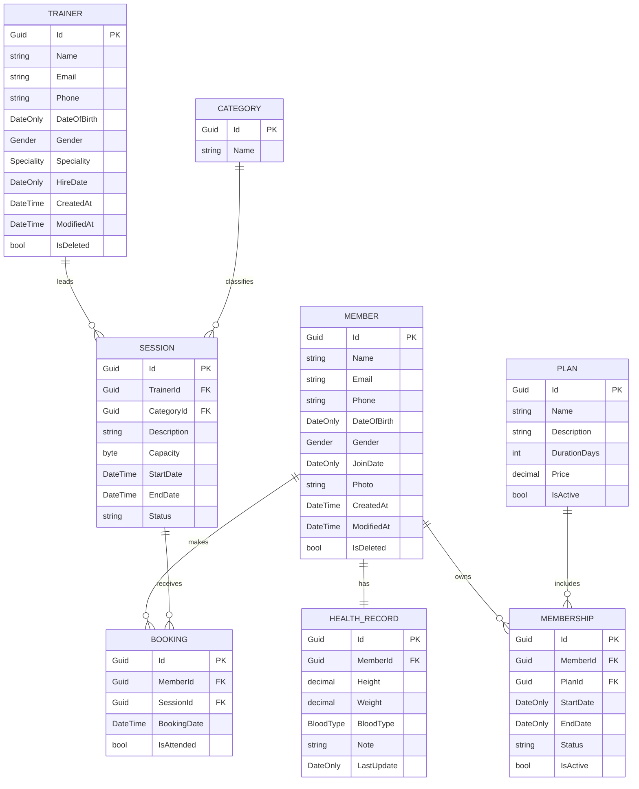

# Gym Management System MVC

A layered **ASP.NET Core MVC** web application for managing gym operations such as members, trainers, plans, memberships, sessions, bookings, and attendance. The project follows a clean multi-project structure with separate Presentation, Business Logic, and Data Access layers.

---

## Table of Contents

- [About the Project](#about-the-project)
- [Key Features](#key-features)
- [Tech Stack](#tech-stack)
- [Solution Architecture](#solution-architecture)
- [Project Structure](#project-structure)
- [Main Modules](#main-modules)
- [Database and Seeding](#database-and-seeding)
- [Entity Relationship Diagram ERD](#entity-relationship-diagram-erd)
- [Default Login Accounts](#default-login-accounts)
- [Prerequisites](#prerequisites)
- [Getting Started](#getting-started)
- [Configuration](#configuration)
- [Running the Application](#running-the-application)
- [Useful Commands](#useful-commands)
- [Application Flow](#application-flow)
- [Security Notes](#security-notes)
- [Logging](#logging)
- [Troubleshooting](#troubleshooting)
- [Contributing](#contributing)

---

## About the Project

**Gym Management System MVC** is a web-based administration system built with ASP.NET Core MVC. It is designed to help gym administrators manage the core parts of a fitness center, including:

- Member records
- Trainer records
- Subscription plans
- Memberships
- Training sessions
- Session bookings
- Attendance tracking
- Authentication and role-based authorization

The application uses a layered architecture to keep UI, business rules, and persistence logic separated. This makes the project easier to maintain, extend, test, and understand.

---

## Key Features

### Authentication and Authorization

- Login and logout functionality using ASP.NET Core Identity.
- Protected routes using `[Authorize]`.
- Role-based access control for sensitive modules.
- Super Admin access for member management.
- Access denied page for unauthorized users.

### Member Management

- View all members.
- View member details.
- Create new members.
- Edit existing members.
- Delete members.
- View member health record details.
- Retrieve member profile pictures.
- Store and serve member images from the `Files/MemberImages` directory.

### Trainer Management

- View all trainers.
- View trainer details.
- Create new trainers.
- Edit trainer information.
- Delete trainers.

### Plan Management

- View all plans.
- View plan details.
- Edit plan data.
- Activate or deactivate plans.

### Session Management

- View all sessions.
- Create sessions.
- Edit sessions.
- View session details.
- Delete sessions when allowed by business rules.
- Select trainers and categories through dropdown lists.

### Booking and Attendance Management

- View upcoming and ongoing sessions.
- View members booked in a session.
- Book available members into upcoming sessions.
- Cancel bookings.
- Mark member attendance for ongoing sessions.

### Database Automation

- Database migration is triggered on application startup.
- Seed data is inserted during startup.
- Default admin accounts are configured through `appsettings.json`.

### Logging

- Serilog is configured as the application logger.
- Console logging is supported.
- Seq logging is configured using `http://localhost:5341`.

---

## Tech Stack

| Area | Technology |
|---|---|
| Framework | ASP.NET Core MVC |
| Language | C# |
| Target Framework | .NET 10 |
| UI | Razor Views, HTML, CSS |
| Authentication | ASP.NET Core Identity |
| ORM | Entity Framework Core |
| Database | SQL Server |
| Mapping | AutoMapper |
| Logging | Serilog, Seq |
| Architecture | Layered Architecture, Repository Pattern, Unit of Work, DTOs, ViewModels |

---

## Solution Architecture

The solution contains three main projects:

```text
GymManagementSystem.slnx
│
├── GymManagementSystem.Presentation
├── GymManagementSystem.BusinessLogic
└── GymManagementSystem.DataAccess
```

### 1. GymManagementSystem.Presentation

The MVC web layer. It contains controllers, views, view models, validations, middleware, static files, and application startup configuration.

Responsibilities:

- Handle HTTP requests.
- Render Razor views.
- Receive and validate user input.
- Map ViewModels to DTOs.
- Call business services.
- Configure middleware and routing.

### 2. GymManagementSystem.BusinessLogic

The service layer. It contains business services, DTOs, contracts, helpers, business specifications, and mapping profiles.

Responsibilities:

- Implement business rules.
- Coordinate application workflows.
- Return success/failure results.
- Validate domain-level operations.
- Communicate with repositories through contracts.

### 3. GymManagementSystem.DataAccess

The persistence layer. It contains EF Core context, models, repositories, specifications, seeders, interceptors, enums, value objects, and Unit of Work implementation.

Responsibilities:

- Define database entities.
- Configure database access.
- Implement repositories.
- Run migrations.
- Seed initial data.
- Manage persistence concerns.

---

## Project Structure

```text
Gym-Management-System-MVC/
│
├── GymManagementSystem.BusinessLogic/
│   ├── BusinessSpecifictions/
│   ├── Common/
│   ├── Contracts/
│   ├── DTOs/
│   ├── Extensions/
│   ├── Helpers/
│   ├── MappingProfiles/
│   └── Services/
│
├── GymManagementSystem.DataAccess/
│   ├── Data/
│   ├── Enums/
│   ├── Extensions/
│   ├── Interceptors/
│   ├── Models/
│   ├── Repositories/
│   ├── Seeders/
│   ├── Specifiction/
│   ├── UoW/
│   └── ValueObjects/
│
├── GymManagementSystem.Presentation/
│   ├── Controllers/
│   ├── Extensions/
│   ├── Files/
│   │   └── MemberImages/
│   ├── MappingProfiles/
│   ├── Middlewares/
│   ├── Models/
│   ├── Properties/
│   ├── Validations/
│   ├── ViewModels/
│   ├── Views/
│   ├── wwwroot/
│   ├── Program.cs
│   ├── appsettings.json
│   └── appsettings.Development.json
│
├── .gitignore
└── GymManagementSystem.slnx
```

---

## Main Modules

### Account Module

Controller: `AccountController`

Handles user authentication.

Main endpoints:

- `GET /Account/Login`
- `POST /Account/Login`
- `POST /Account/Logout`
- `GET /Account/AccessDenied`

The default route opens the login page first:

```csharp
{controller=Account}/{action=Login}/{id?}
```

### Members Module

Controller: `MembersController`

This module is restricted to the `SuperAdmin` role.

Main operations:

- List members
- View member details
- Create member
- Edit member
- Delete member
- View health record details
- View profile picture

### Trainers Module

Controller: `TrainersController`

Main operations:

- List trainers
- View trainer details
- Create trainer
- Edit trainer
- Delete trainer

### Plans Module

Controller: `PlansController`

Main operations:

- List plans
- View plan details
- Edit plan
- Change plan status

### Sessions Module

Controller: `SessionsController`

Main operations:

- List sessions
- Create session
- View session details
- Edit session
- Delete session
- Load trainer dropdown values
- Load category dropdown values

### Bookings Module

Controller: `BookingsController`

Main operations:

- View upcoming and ongoing sessions
- View session members
- Create a booking
- Cancel a booking
- Mark attendance
- Load available members for booking

---

## Database and Seeding

The application uses SQL Server with Entity Framework Core. The development connection string is configured in:

```text
GymManagementSystem.Presentation/appsettings.Development.json
```

Connection strings should be configured locally and should not be committed with real server names, usernames, passwords, or production details. Use placeholders in committed configuration files:

```json
{
  "ConnectionStrings": {
    "DefaultConnection": "<YOUR_LOCAL_OR_ENVIRONMENT_CONNECTION_STRING>"
  }
}
```

On startup, the application calls a migration and seeding extension method:

```csharp
await app.MigrateAndSeedDatabase(builder.Configuration);
```

This means the application is intended to create/update the database schema and seed initial data when it starts.

---

## Entity Relationship Diagram ERD

The following ERD summarizes the main business entities and how they are connected in the database. It focuses on the gym domain models such as members, trainers, plans, memberships, sessions, bookings, categories, and health records.



### Relationship Summary

| Relationship | Type | Description |
|---|---|---|
| Member to HealthRecord | One-to-One | Each member has one health record containing height, weight, blood type, notes, and last update date. |
| Member to Membership | One-to-Many | A member can have multiple memberships over time. |
| Plan to Membership | One-to-Many | A plan can be assigned to many memberships. |
| Trainer to Session | One-to-Many | A trainer can lead many sessions. |
| Category to Session | One-to-Many | A category can classify many sessions. |
| Member to Booking | One-to-Many | A member can book many sessions. |
| Session to Booking | One-to-Many | A session can have many member bookings. |

### Notes

- `Member` and `Trainer` inherit shared user fields from `GymUser`, such as name, email, phone, date of birth, gender, and address.
- Most business entities inherit common audit fields from `BaseEntity`, including `Id`, `CreatedAt`, `ModifiedAt`, `DeletedAt`, and `IsDeleted`.
- `Membership.EndDate`, `Membership.Status`, `Membership.IsActive`, and `Session.Status` are calculated from existing dates and business rules.
- Authentication and authorization tables are handled separately by ASP.NET Core Identity and are not included in this business-domain ERD.

---

## Default Login Accounts

The application supports seeded identity users configured through `appsettings.json`. For security reasons, do not document or commit real emails, passwords, or production credentials.

Use placeholder values in committed configuration files, then provide the real values through user secrets, environment variables, or a secure secret store:

```json
{
  "SeedUsers": {
    "SuperAdmin": {
      "Email": "<SUPER_ADMIN_EMAIL>",
      "Password": "<SUPER_ADMIN_PASSWORD>"
    },
    "Admin": {
      "Email": "<ADMIN_EMAIL>",
      "Password": "<ADMIN_PASSWORD>"
    }
  }
}
```

> Important: Never commit real seeded login credentials to source control. Rotate any credentials that were previously committed.

---

## Prerequisites

Before running the project, make sure you have the following installed:

- Git
- Visual Studio 2022 or later, Visual Studio Code, or JetBrains Rider
- .NET 10 SDK
- SQL Server or SQL Server Express
- SQL Server Management Studio or Azure Data Studio, optional but recommended
- Seq, optional, for viewing structured logs at `http://localhost:5341`

---

## Getting Started

### 1. Clone the Repository

```bash
git clone https://github.com/Mark-Ehab/Gym-Management-System-MVC.git
cd Gym-Management-System-MVC
```

### 2. Restore Dependencies

```bash
dotnet restore
```

### 3. Update the Database Connection String

Open:

```text
GymManagementSystem.Presentation/appsettings.Development.json
```

Update the connection string locally using a safe development value. Do not commit real infrastructure details or credentials.

Recommended placeholder format for committed files:

```json
"DefaultConnection": "<YOUR_LOCAL_OR_ENVIRONMENT_CONNECTION_STRING>"
```

For local development, store the actual value in one of the following instead of hardcoding it in the repository:

- .NET User Secrets
- Environment variables
- A local, untracked configuration override
- A secure secret store such as Azure Key Vault

### 4. Run the Application

From the repository root:

```bash
dotnet run --project GymManagementSystem.Presentation
```

The application should start and listen on the configured ASP.NET Core launch URL.

### 5. Open the Application

Open the URL shown in the terminal, then log in using accounts configured securely in your local environment.

---

## Configuration

### appsettings.json

Contains general application configuration:

- Serilog configuration
- Seq sink URL
- Seed user configuration placeholders only
- Allowed hosts

### appsettings.Development.json

Contains development-specific settings:

- Logging level
- SQL Server connection string placeholder or local-only value

---

## Running the Application

The application startup pipeline performs the following steps:

1. Configures Serilog.
2. Registers Presentation services.
3. Registers Business Logic services.
4. Registers Data Access services.
5. Builds the ASP.NET Core application.
6. Migrates and seeds the database.
7. Enables exception handling and HSTS outside development.
8. Enables HTTPS redirection.
9. Enables authentication and authorization.
10. Maps static assets.
11. Maps the default MVC route.

Default route:

```csharp
app.MapControllerRoute(
    name: "default",
    pattern: "{controller=Account}/{action=Login}/{id?}");
```

---

## Useful Commands

### Restore packages

```bash
dotnet restore
```

### Build solution

```bash
dotnet build
```

### Run the MVC application

```bash
dotnet run --project GymManagementSystem.Presentation
```

### Run in Development environment

Windows PowerShell:

```powershell
$env:ASPNETCORE_ENVIRONMENT="Development"
dotnet run --project GymManagementSystem.Presentation
```

Linux/macOS:

```bash
ASPNETCORE_ENVIRONMENT=Development dotnet run --project GymManagementSystem.Presentation
```

### Add a new migration

Run this from the repository root:

```bash
dotnet ef migrations add MigrationName \
  --project GymManagementSystem.DataAccess \
  --startup-project GymManagementSystem.Presentation
```

### Update the database manually

```bash
dotnet ef database update \
  --project GymManagementSystem.DataAccess \
  --startup-project GymManagementSystem.Presentation
```

> Note: The application already attempts to migrate and seed the database during startup, so manual database update commands may not be required in normal local development.

---

## Application Flow

A typical flow in the system looks like this:

1. User opens the application.
2. User is redirected to the login page.
3. User logs in using a seeded account.
4. Authorized user accesses management modules.
5. Admin creates trainers, plans, sessions, and members.
6. Members can be booked into upcoming sessions.
7. Attendance can be marked for ongoing sessions.
8. Business services validate operations before database changes are saved.

---

## Security Notes

- The project uses ASP.NET Core Identity for authentication.
- Sensitive actions use anti-forgery validation with `[ValidateAntiForgeryToken]`.
- Most management controllers are protected with `[Authorize]`.
- Member management is restricted to the `SuperAdmin` role.
- Default seeded credentials must be changed before production use.
- Do not commit production connection strings, passwords, or secrets to source control.
- Use user secrets, environment variables, Azure Key Vault, or another secure secret store for real deployments.

---

## Logging

Serilog is configured in `Program.cs` and `appsettings.json`.

Configured sinks:

- Console
- Seq

Default Seq URL:

```text
http://localhost:5341
```

To use Seq locally:

1. Install and run Seq.
2. Make sure it is available on `http://localhost:5341`.
3. Start the application.
4. Open the Seq dashboard to inspect logs.

If Seq is not running, the application may still run depending on logging sink behavior, but structured log viewing in Seq will not be available.

---

## Troubleshooting

### SQL Server connection fails

Check the connection string in `appsettings.Development.json`.

Common fixes:

- Use `.\\SQLEXPRESS` if you are using SQL Server Express.
- Use `(localdb)\\MSSQLLocalDB` if you are using LocalDB.
- Make sure SQL Server is running.
- Make sure the database user has permission to create and update the database.

### Login does not work

Check that database seeding ran successfully and that the seeded accounts exist. Verify that your local secret values match the values used when the database was seeded.

If credentials were changed after the first seed, update the existing user records, reseed the database, or reset the development database.

### Static files are not loading

Make sure the application is running from the `GymManagementSystem.Presentation` project and that the `wwwroot` folder exists.

### Seq is unavailable

Start Seq locally or update the configured Seq URL in `appsettings.json`.

### EF Core command not found

Install the EF Core CLI tool:

```bash
dotnet tool install --global dotnet-ef
```

Then verify installation:

```bash
dotnet ef --version
```

---

## Contributing

Contributions are welcome.

Suggested workflow:

1. Fork the repository.
2. Create a new feature branch.

```bash
git checkout -b feature/your-feature-name
```

3. Commit your changes.

```bash
git commit -m "Add your feature"
```

4. Push your branch.

```bash
git push origin feature/your-feature-name
```

5. Open a pull request.

Please keep changes focused, readable, and consistent with the existing layered architecture.

---

## Author

Repository owner: [Mark-Ehab](https://github.com/Mark-Ehab)

Project repository: [Gym-Management-System-MVC](https://github.com/Mark-Ehab/Gym-Management-System-MVC)

---

Made with ❤️ by Mark Ehab
